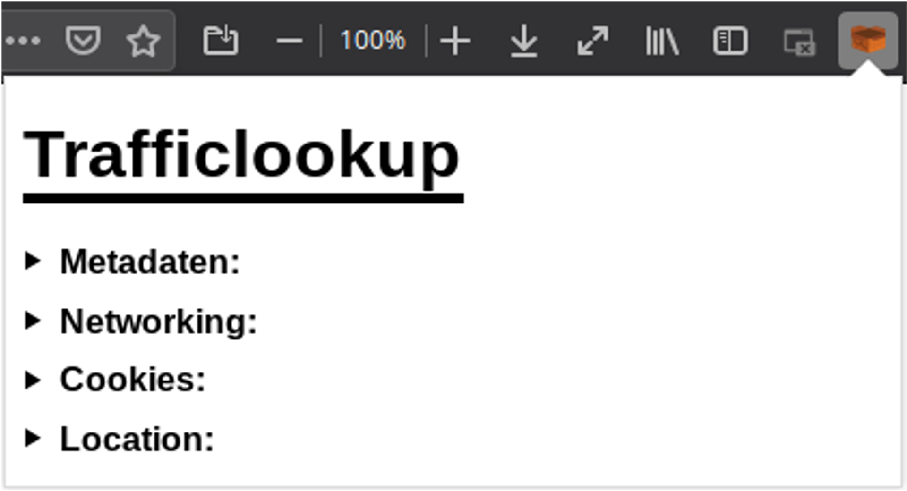

# Trafficlookup

Hey, with this Firefox extension you can see wich data will be sniffed.

## Usage
With this extension you'll get a box icon in your top bar. If you open it, you can see wich cookies have been send threw this webpage. You can also see your systeminfrmations, browserinformations, your private/public IP and of course your location. It shows your coordinates and if you want, it can show these coordinates on openstreetmap (https://www.openstreetmap.org/).

## Version History
* 1.1.0
    * Functional extension structure.
* 1.2.0
    * A pile of changes and performance improves.
* 1.3.0
    * We fixed a lot of bugs.
* 1.4.0
    * We've done a lot to improve speed and useability.
## Authors
Programming:
Maris Beer, Sacha Schrempp

Layout:
Silas Schimmel

Website:
Maris Beer, Silas Schimmel, Sascha Schrempp
